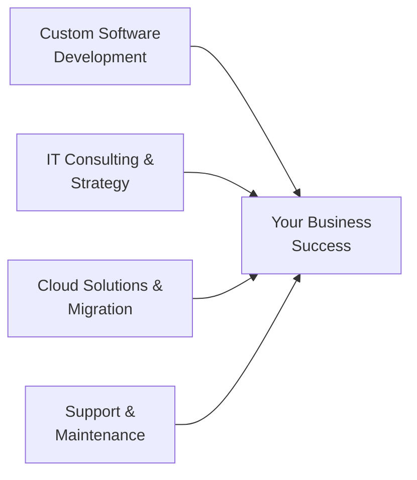

# VINKS Services LLP

  
  
  
  ### Software Solutions Consulting
  
  *Transforming businesses through innovative technology since 2010*
  
  
  
  
  

---

## 🚀 About Us

VINKS Services LLP is a leading software consulting firm specializing in delivering innovative technology solutions across diverse industries. With over **15 years of experience**, we have established ourselves as a trusted partner for organizations seeking digital transformation.

### 🎯 Our Mission

To empower organizations with innovative software solutions that transform operations and drive sustainable growth.

### 🌟 Our Vision

To be the preferred technology partner for businesses seeking excellence in digital transformation.

---

## 💼 What We Do

### Core Services

- **🖥️ Custom Software Development** - Tailored solutions designed for your specific needs
- **💡 IT Consulting** - Strategic technology guidance and digital transformation
- **☁️ Cloud Solutions** - Scalable infrastructure and cloud migration services
- **🗄️ Database Management** - Comprehensive database design, optimization, and maintenance
- **🔒 Security & Compliance** - Robust security implementations and compliance solutions
- **🛠️ Support & Maintenance** - 24/7 technical support and ongoing system care

---

## 🏢 Industry Expertise

<table>
<tr>
<td width="50%">

### 🏥 Insurance
- Policy Management Systems
- Claims Processing Automation
- Agent & Customer Portals
- Regulatory Compliance Tools

**25+ Clients | 60+ Projects**

</td>
<td width="50%">

### ⚡ Gas Distribution
- Distribution Network Management
- Inventory Tracking Systems
- Automated Billing Solutions
- Delivery Route Optimization

**15+ Clients | 40+ Projects**

</td>
</tr>
<tr>
<td width="50%">

### 🏛️ Government
- Citizen Services Portals
- Document Management Systems
- Workflow Automation
- Data Analytics Platforms

**10+ Clients | 35+ Projects**

</td>
<td width="50%">

### 🌍 International Clients
- Multi-tenant SaaS Platforms
- Localization & Translation
- Global Payment Integration
- Cross-border Compliance

**20+ Clients | 65+ Projects**

</td>
</tr>
</table>

---

## 📊 By The Numbers

| Metric | Count |
|--------|-------|
| 📅 **Years of Excellence** | 15+ |
| 🎯 **Projects Delivered** | 200+ |
| 🤝 **Satisfied Clients** | 50+ |
| 💯 **Client Retention** | 99% |
| ⭐ **Average Rating** | 4.9/5 |

---

## 🛠️ Technology Stack

### Languages & Frameworks

### Cloud & DevOps

### Databases

---

## 🌟 Core Values

<table>
<tr>
<td align="center" width="25%">
  
### ✅ Quality First
We deliver high-quality solutions that exceed expectations and stand the test of time.

</td>
<td align="center" width="25%">

### ⚡ Innovation
Leveraging cutting-edge technologies to create innovative solutions for modern challenges.

</td>
<td align="center" width="25%">

### 🤝 Client-Centric
Your success is our priority. We build lasting partnerships through exceptional service.

</td>
<td align="center" width="25%">

### 🔒 Security & Trust
Implementing robust security measures and maintaining the highest standards of integrity.

</td>
</tr>
</table>

---

## 📈 Recent Projects

### Featured Work

- 🏥 **Insurance Management Platform** - Comprehensive policy and claims management system serving 100K+ users
- ⚡ **Smart Gas Distribution System** - Real-time tracking and automated billing for 50+ distributors
- 🏛️ **Citizen Services Portal** - Government e-services platform handling 1M+ monthly transactions
- 🌍 **Multi-tenant SaaS Platform** - Global B2B platform with localization in 12+ languages

---

## 📫 Get In Touch

### Ready to Transform Your Business?

We're here to help you achieve your digital transformation goals.

**📧 Email:** [info@vinksservices.com](mailto:info@vinksservices.com)  
**📞 Phone:** +91 (022) 1234-5678  
**🌐 Website:** [vinksllp.github.io](https://vinksllp.github.io)  
**📍 Location:** Mumbai, Maharashtra, India

---

### ✨ Why Choose VINKS?

✅ Free initial consultation  
✅ Custom solution proposals  
✅ Dedicated project manager  
✅ ISO certified quality  
✅ 24/7 support available

---

© 2025 VINKS Services LLP. All rights reserved. | Building digital solutions since 2010

